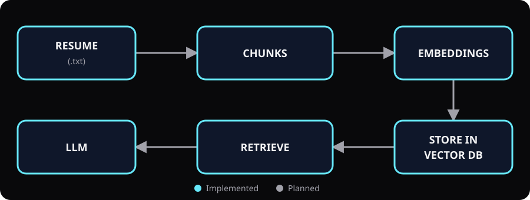

# Resume Analyser RAG

A Node.js command-line application for analysing resumes with a
retrieval-augmented generation (RAG) pipeline. It chunks a plain-text resume,
creates Hugging Face embeddings, retrieves relevant context from Supabase, and
uses Google Gemini to generate career feedback. A user interface is planned.



## Current status

| Stage | Status | What it does |
| --- | --- | --- |
| Read resume | Implemented | Loads `resume.txt` from the project directory. |
| Create chunks | Implemented | Splits the resume into 500-character chunks with 50-character overlap. |
| Create embeddings | Implemented | Converts chunks into vectors with Hugging Face. |
| Store vectors | Implemented | Supports one-time ingestion into Supabase. |
| Retrieve context | Implemented | Finds resume chunks relevant to the analysis query. |
| Generate analysis | Implemented | Sends retrieved context to Gemini for career feedback. |
| User interface | Planned | Will provide an easier way to upload and analyse resumes. |

## Requirements

- [Node.js](https://nodejs.org/) 20 or newer
- npm
- A plain-text resume (`.txt`)
- A Supabase `documents` table and `match_documents` database function
- Hugging Face and Google Gemini API keys

## Getting started

1. Clone the repository and enter it:

   ```powershell
   git clone https://github.com/shefali289/resume_analyser_rag.git
   cd resume_analyser_rag
   ```

2. Install the dependencies:

   ```powershell
   npm install
   ```

   If PowerShell blocks `npm.ps1`, use the Windows command shim:

   ```powershell
   npm.cmd install
   ```

3. Create `resume.txt` in the project root and paste the resume's plain text
   into it. This file is ignored by Git to avoid committing personal data.

4. Run the application:

   ```powershell
   npm start
   ```

   Or, when PowerShell blocks npm scripts:

   ```powershell
   npm.cmd start
   ```

   You can also run the entry point directly:

   ```powershell
   node index.js
   ```

The command retrieves relevant resume chunks from Supabase and prints
Gemini-generated feedback about strengths, suitable roles, and areas for
improvement.

## Environment variables

Copy `.env.sample` to `.env` and provide the required configuration:

```powershell
Copy-Item .env.sample .env
```

| Variable | Intended use |
| --- | --- |
| `HF_API_KEY` | Hugging Face services or models. |
| `SUPABASE_URL` | Supabase project URL. |
| `SUPABASE_KEY` | Supabase project API key. |
| `GEMINI_API_KEY` | Google Gemini model access. |
| `GEMINI_MODEL` | Gemini model ID; use `gemini-3.6-flash`. |

All five variables are required by the current script. `SUPABASE_URL` must be
the project base URL (for example, `https://PROJECT_REF.supabase.co`) without a
`/rest/v1` suffix. Never commit `.env` or real credentials.

## Project structure

```text
resume_analyser_rag/
|-- docs/
|   `-- architecture.svg
|-- .env.sample
|-- .gitignore
|-- index.js
|-- package.json
`-- README.md
```

## How the pipeline works

1. Read resume text from the uploaded or local file.
2. Split the text into small overlapping chunks.
3. Create a vector embedding for every chunk.
4. Store the chunks and embeddings in the vector database.
5. Retrieve the chunks most relevant to the user's request.
6. Give that context to the LLM to generate grounded resume analysis.

The command currently uses the existing vectors in Supabase. To ingest or
refresh a resume, temporarily uncomment the documented
`SupabaseVectorStore.fromDocuments(...)` block in `index.js`, run the command
once, and comment it again to avoid inserting duplicate chunks. The UI will be
added later.
